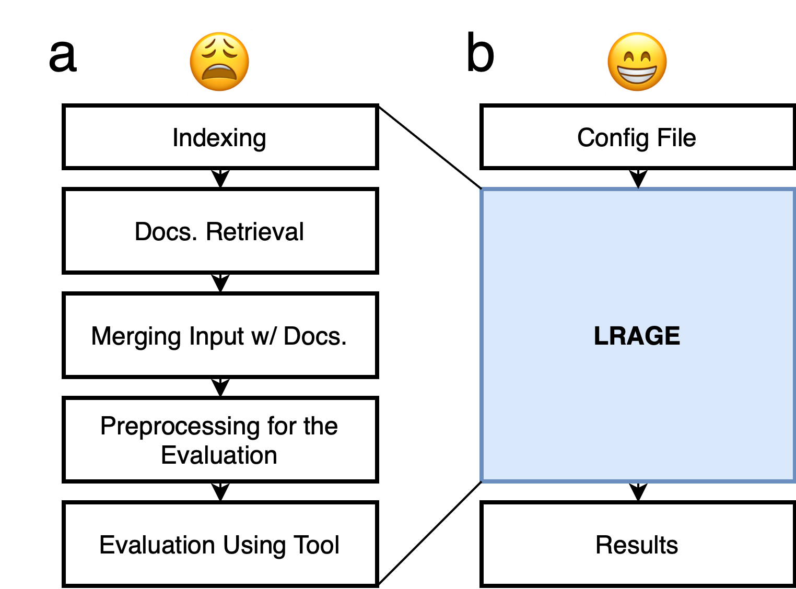
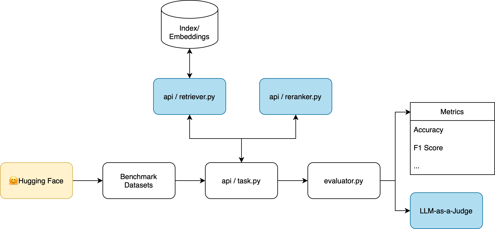

# ⚖️ LRAGE: Legal Retrieval Augmented Generation Evaluation Tool

LRAGE (Legal Retrieval Augmented Generation Evaluation, pronounced as 'large') is an open-source toolkit designed to evaluate Large Language Models (LLMs) in a Retrieval-Augmented Generation (RAG) setting, specifically tailored for the legal domain.  

LRAGE is developed to address the unique challenges that Legal AI researchers face, such as building and evaluating retrieval-augmented systems effectively. It seamlessly integrates datasets and tools to help researchers in evaluating LLM performance on legal tasks without cumbersome engineering overhead.

The submission version for NAACL can be found in this [tag](https://github.com/hoorangyee/LRAGE/tree/naacl).

You can check the demo video at [here](https://youtu.be/1Sy8kYY03bo).


## Features

<p align="center">
    
</p>

- **Legal Domain Focused Evaluation**: LRAGE is specifically developed for evaluating LLMs in a RAG setting with datasets and document collections from the legal domain, such as [Pile-of-law](https://huggingface.co/datasets/pile-of-law/pile-of-law) and [LegalBench](https://github.com/HazyResearch/legalbench).

- **Pre-compiled indexes for the legal domain**: Comes with pre-generated BM25 indices and embeddings for Pile-of-law, reducing the setup effort for researchers.  

- **Retriever & Reranker Integration**: Easily integrate and evaluate different retrievers and rerankers. LRAGE modularizes retrieval and reranking components, allowing for flexible experimentation.  

- **LLM-as-a-Judge**: A feature where LLMs are used to evaluate the quality of LLM responses on an instance-by-instance basis, using customizable rubrics within the RAG setting.  

- **Graphical User Interface**: A GUI demo for intuitive usage, making the tool accessible even for those who are not deeply familiar with command-line interfaces.  

## Extensions for RAG Evaluation from [lm-evaluation-harness](https://github.com/EleutherAI/lm-evaluation-harness)

<p align="center">
    
</p>

1.	**Addition of Retriever and Reranker abstract classes**: LRAGE introduces [retriever](https://github.com/hoorangyee/LRAGE/blob/main/lrage/api/retriever.py) and [reranker](https://github.com/hoorangyee/LRAGE/blob/main/lrage/api/reranker.py) abstract classes in the [lrage/api/](https://github.com/hoorangyee/LRAGE/tree/main/lrage/api). These additions allow the process of building requests in the [api.task.Task](https://github.com/hoorangyee/LRAGE/blob/b24b7dc253fdfaa82cd926d1d1147f8a18ec69bf/lrage/api/task.py#L179) class’s [build_all_requests()](https://github.com/hoorangyee/LRAGE/blob/b24b7dc253fdfaa82cd926d1d1147f8a18ec69bf/lrage/api/task.py#L376) method to go through both retrieval and reranking steps, enhancing the evaluation process for RAG.  


2.	**Extensible Retriever and Reranker implementations**: While maintaining the same structure as lm-evaluation-harness, LRAGE allows for the flexible integration of different retriever and reranker implementations. Just as lm-evaluation-harness provides an abstract [LM class](https://github.com/hoorangyee/LRAGE/blob/b24b7dc253fdfaa82cd926d1d1147f8a18ec69bf/lrage/api/model.py#L20) with implementations for libraries like HuggingFace (hf) and vLLM, LRAGE provides [pyserini_retriever](https://github.com/hoorangyee/LRAGE/blob/main/lrage/retrievers/pyserini_retriever.py) (powered by [Pyserini](https://github.com/castorini/pyserini)) in [lrage/retrievers/](https://github.com/hoorangyee/LRAGE/tree/main/lrage/retrievers) and [rerankers_reranker](https://github.com/hoorangyee/LRAGE/blob/main/lrage/rerankers/rerankers_reranker.py) (powered by [rerankers](https://github.com/AnswerDotAI/rerankers)) in [lrage/rerankers/](https://github.com/hoorangyee/LRAGE/tree/main/lrage/rerankers). This structure allows users to easily implement and integrate other retrievers or rerankers, such as those from [LlamaIndex](https://github.com/run-llama/llama_index), by simply extending the abstract classes.

3. **Integration of LLM-as-a-judge**: LRAGE modifies [ConfigurableTask.process_results](https://github.com/hoorangyee/LRAGE/blob/479534d59a95b2b0c7cc37fd4c0db574418c61da/lrage/api/task.py#L1528) to support 'LLM-Eval' metrics, enabling a more nuanced evaluation of RAG outputs by utilizing language models as judges.

## Installation

1. Create conda environment:
    ```bash
    conda create -n lrage python=3.10 -y
    conda activate lrage
    ```

2. Clone the repository:
    ```bash
    git clone https://github.com/hoorangyee/LRAGE.git
    cd LRAGE/
    ```
3. Install:
    ```bash
    conda install -c conda-forge openjdk=21 -y # JDK 21 is required to use the Pyserini retriever
    pip install -e .
    ```

## Quick Start

To evaluate a model on a sample dataset using the RAG setting, follow these steps:

1. Prepare your dataset in the supported format.

2. Choose one of the following methods to run:  

   A. Run the evaluation script in CLI:
   ```bash
   lrage \
   --model hf \
   --model_args pretrained=meta-llama/Llama-3.2-1B \
   --tasks abercrombie_tiny \
   --batch_size 8 \
   --device cuda \
   --retrieve_docs \
   --top_k 3 \
   --retriever pyserini \
   --retriever_args retriever_type=bm25,bm25_index_path=msmarco-v1-passage \
   --rerank \
   --reranker rerankers \
   --reranker_args reranker_type=colbert
   ```

   B. Run the GUI:
   ```bash
   cd LRAGE
   ./run_gui.sh
   ```

   


## Basic Usage

The basic usage follows the [lm-evaluation-harness](https://github.com/EleutherAI/lm-evaluation-harness) documentation. 

Below is a detailed guide for using the LRAGE CLI.

### CLI Arguments

#### Required Arguments
- `--model`, `-m`: Name of the model to use (e.g., `hf` for HuggingFace models)
- `--tasks`, `-t`: Names of tasks to evaluate (comma-separated)
  - To see available tasks: `lrage --tasks list`

#### Model Configuration
- `--model_args`, `-a`: Arguments for model configuration
  - Format: `key1=value1,key2=value2`
  - Example: `pretrained=meta-llama/Llama-3.1-8B,dtype=float32`
- `--device`: Device to use (e.g., `cuda`, `cuda:0`, `cpu`)
- `--batch_size`, `-b`: Batch size (`auto`, `auto:N`, or integer)
- `--system_instruction`: System instruction for the prompt
- `--apply_chat_template`: Enable chat template (flag)

#### RAG Settings
- `--retrieve_docs`: Enable document retrieval
- `--top_k`: Number of documents to retrieve per query (default: 3)
- `--retriever`: Type of retriever (e.g., `pyserini`)
- `--rerank`: Enable reranking
- `--reranker`: Type of reranker (e.g., `rerankers`)

### Retrievers and Rerankers Configuration
#### Retriever Arguments
<table>
  <tr>
    <th><code>retriever</code></th>
    <th>Argument</th>
    <th>Required</th>
    <th>Description</th>
    <th>Example</th>
  </tr>
  <tr>
    <td rowspan="5"><a href="https://github.com/castorini/pyserini">pyserini</a></td>
    <td><code>retriever_type</code></td>
    <td>Yes</td>
    <td>Type of retriever to use</td>
    <td><code>bm25</code>, <code>sparse</code>, <code>dense</code>, <code>hybrid</code></td>
  </tr>
  <tr>
    <td><code>bm25_index_path</code></td>
    <td>Yes</td>
    <td>Path to BM25 index or prebuilt index name</td>
    <td><code>msmarco-v1-passage</code></td>
  </tr>
  <tr>
    <td><code>encoder_path</code></td>
    <td>For sparse/dense/hybrid</td>
    <td>Path to encoder or prebuilt encoder name</td>
    <td><code>castorini/tct_colbert-v2-hnp-msmarco</code></td>
  </tr>
  <tr>
    <td><code>encoder_type</code></td>
    <td>Optional</td>
    <td>Type of encoder</td>
    <td><code>tct_colbert</code>, <code>dpr</code>, <code>auto</code></td>
  </tr>
  <tr>
    <td><code>faiss_index_path</code></td>
    <td>For dense/hybrid</td>
    <td>Path to FAISS index or prebuilt index name</td>
    <td><code>msmarco-v1-passage.tct_colbert-v2-hnp</code></td>
  </tr>
</table>

**Note:** Since FAISS index and Sparse Vector Index (embedding generated by SPLADE, etc.) do not contain the original documents, when using them, a BM25 index is also needed for original document lookup.

**Supported Prebuilt Resources:**
- [Pyserini's prebuilt BM25 indexes](https://github.com/castorini/pyserini/blob/master/docs/prebuilt-indexes.md#lucene-standard-inverted-indexes)
- [Pyserini's prebuilt FAISS indexes](https://github.com/castorini/pyserini/blob/master/docs/prebuilt-indexes.md#faiss-indexes)

**Example Usage:**
```bash
--retriever_args retriever_type=bm25,bm25_index_path=msmarco-v1-passage
```

#### Reranker Arguments

<table>
  <tr>
    <th><code>reranker</code></th>
    <th>Argument</th>
    <th>Required</th>
    <th>Description</th>
    <th>Example</th>
  </tr>
  <tr>
    <td rowspan="4"><a href="https://github.com/AnswerDotAI/rerankers">rerankers</a></td>
    <td><code>reranker_type</code></td>
    <td>Yes</td>
    <td>Type of reranker to use</td>
    <td><code>colbert</code></td>
  </tr>
  <tr>
    <td><code>reranker_path</code></td>
    <td>Optional</td>
    <td>Name of specific reranker model</td>
    <td><code>gpt-4o</code> with <code>reranker_type=rankllm</code></td>
  </tr>
</table>

**Example Usage:**
```bash
--reranker_args reranker_type=colbert
```

#### Evaluation Settings
- `--judge_model`: Model for LLM-as-judge evaluation
- `--judge_model_args`: Configuration for judge model
- `--judge_device`: Device for judge model
- `--num_fewshot`, `-f`: Number of few-shot examples
- `--output_path`, `-o`: Path for saving results
- `--log_samples`, `-s`: Save model outputs and documents
- `--predict_only`, `-x`: Only generate predictions without evaluation

### Example Commands

1. Basic BM25 Evaluation:
```bash
lrage \
--model hf \
--model_args pretrained=meta-llama/Llama-3.1-8B \
--tasks legalbench_tiny \
--batch_size 8 \
--device cuda \
--retrieve_docs \
--retriever pyserini \
--retriever_args retriever_type=bm25,bm25_index_path=msmarco-v1-passage
```

2. Dense Retrieval with Reranking:
```bash
lrage \
--model hf \
--model_args pretrained=meta-llama/Llama-3.1-8B \
--tasks legalbench_tiny \
--batch_size 8 \
--device cuda \
--retrieve_docs \
--top_k 3 \
--retriever pyserini \
--retriever_args \
    retriever_type=dense,\
    bm25_index_path=msmarco-v1-passage,\
    faiss_index_path=msmarco-v1-passage.tct_colbert-v2-hnp,\
    encoder_path=castorini/tct_colbert-v2-hnp-msmarco,\
    encoder_type=tct_colbert \
--rerank \
--reranker rerankers \
--reranker_args reranker_type=colbert
```

3. Evaluation with LLM-as-a-Judge:

**Note**: LLM-as-a-judge evaluation is only available for tasks that specifically use the 'LLM-Eval' metric in their configuration. Make sure your task is configured to use this metric before applying the judge model.

```bash
lrage \
--model hf \
--model_args pretrained=meta-llama/Llama-3.1-8B \
--tasks legalbench_tiny \
--judge_model openai-chat-completions \
--judge_model_args model=gpt-4o-mini \
--retrieve_docs \
--retriever pyserini \
--retriever_args retriever_type=bm25,bm25_index_path=msmarco-v1-passage
```
   
   
## Indexing

For now, you have three options:  
1. Use Pyserini's prebuilt indexes available out of the box
2. Use our prebuilt Pile-of-law-mini indexes
3. Create your own index by following [Pyserini's indexing documentation](https://github.com/castorini/pyserini/blob/master/docs/usage-index.md)

#### How to Index a New Corpus Using Pyserini  

3-1. Prepare the data file `docs.json` in the following format:  

```json
[
  {
    "id": "doc1",
    "contents": "contents of doc one."
  },
  {
    "id": "doc2",
    "contents": "contents of document two."
  },
  ...
]
```

3-2. Store the prepared data in the following directory structure.

```
📂 data
├── 📂 input
│   └── docs.json
└── 📂 index
```

3-3. Run the following script.

```bash
python -m pyserini.index.lucene \
  --collection JsonCollection \
  --input data/input \
  --index data/index \
  --generator DefaultLuceneDocumentGenerator \
  --threads 1 \
  --storePositions --storeDocvectors --storeRaw
```

## Pre-compiled indexes for the legal domain

- [pile-of-law-subsets-bm25](https://huggingface.co/datasets/hoorangyee/pile-of-law-bm25)
  - ```
    {
        "legal-case-opinions": ["courtlistener_opinions","tax_rulings", "canadian_decisions", "echr"],
        "laws": ["uscode", "state_codes", "cfr","eurlex", "tax_rulings"],
        "study-materials": ["cc_casebooks"]
    }
    ```

## Roadmap

- [x] Implement LLM-as-a-judge functionality
- [x] Update pyserini_retriever to support Pyserini prebuilt index
- [x] Develop a GUI Demo for easier access and visualization
- [x] Document more detailed usage instructions
- [x] Publish and share Pile-of-law BM25 index
- [ ] Publish and share Pile-of-law chunks
- [ ] Publish and share Pile-of-law embeddings
- [ ] Implement a simplified indexing feature in GUI
- [ ] Publish benchmark results obtained using LRAGE

## Contributing

Contributions and community engagement are welcome! We value your input in making this project better🤗.

## Citation

```
@Misc{lrage,
  title =        {LARGE: Legal Retrieval Augmented Generation Evaluation Tool},
  author =       {Minhu Park, Hongseok Oh, and Wonseok Hwang},
  howpublished = {\url{https://github.com/hoorangyee/LRAGE}},
  year =         {2024}
}   
```
