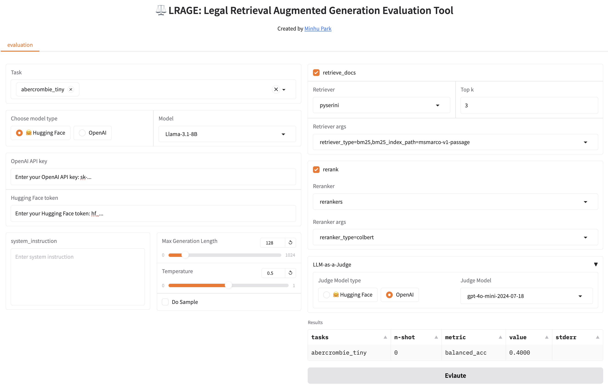

# ⚖️ LRAGE: Legal Retrieval Augmented Generation Evaluation Tool

LRAGE (Legal Retrieval Augmented Generation Evaluation, pronounced as 'large') is an open-source toolkit designed to evaluate Large Language Models (LLMs) in a Retrieval-Augmented Generation (RAG) setting, specifically tailored for the legal domain.  

LRAGE is developed to address the unique challenges that Legal AI researchers face, such as building and evaluating retrieval-augmented systems effectively. It seamlessly integrates datasets and tools to help researchers in evaluating LLM performance on legal tasks without cumbersome engineering overhead.

## Features

- **Legal Domain Focused Evaluation**: LRAGE is specifically developed for evaluating LLMs in a RAG setting with datasets and document collections from the legal domain, such as [Pile-of-law](https://huggingface.co/datasets/pile-of-law/pile-of-law) and [LegalBench](https://github.com/HazyResearch/legalbench).

- **Pre-compiled indexes for the legal domain**: Comes with pre-generated BM25 indices and embeddings for Pile-of-law, reducing the setup effort for researchers.  

- **Retriever & Reranker Integration**: Easily integrate and evaluate different retrievers and rerankers. LRAGE modularizes retrieval and reranking components, allowing for flexible experimentation.  

- **LLM-as-a-Judge**: A feature where LLMs are used to evaluate the quality of LLM responses on an instance-by-instance basis, using customizable rubrics within the RAG setting.  

- **Graphical User Interface**: A GUI demo for intuitive usage, making the tool accessible even for those who are not deeply familiar with command-line interfaces.  

## Extensions for RAG Evaluation from [lm-evaluation-harness](https://github.com/EleutherAI/lm-evaluation-harness)

1.	**Addition of Retriever and Reranker abstract classes**: LRAGE introduces [retriever](https://github.com/hoorangyee/LRAGE/blob/main/lrage/api/retriever.py) and [reranker](https://github.com/hoorangyee/LRAGE/blob/main/lrage/api/reranker.py) abstract classes in the [lrage/api/](https://github.com/hoorangyee/LRAGE/tree/main/lrage/api). These additions allow the process of building requests in the [api.task.Task](https://github.com/hoorangyee/LRAGE/blob/b24b7dc253fdfaa82cd926d1d1147f8a18ec69bf/lrage/api/task.py#L179) class’s [build_all_requests()](https://github.com/hoorangyee/LRAGE/blob/b24b7dc253fdfaa82cd926d1d1147f8a18ec69bf/lrage/api/task.py#L376) method to go through both retrieval and reranking steps, enhancing the evaluation process for RAG.  


2.	**Extensible Retriever and Reranker implementations**: While maintaining the same structure as lm-evaluation-harness, LRAGE allows for the flexible integration of different retriever and reranker implementations. Just as lm-evaluation-harness provides an abstract [LM class](https://github.com/hoorangyee/LRAGE/blob/b24b7dc253fdfaa82cd926d1d1147f8a18ec69bf/lrage/api/model.py#L20) with implementations for libraries like HuggingFace (hf) and vLLM, LRAGE provides [pyserini_retriever](https://github.com/hoorangyee/LRAGE/blob/main/lrage/retrievers/pyserini_retriever.py) (powered by [Pyserini](https://github.com/castorini/pyserini)) in [lrage/retrievers/](https://github.com/hoorangyee/LRAGE/tree/main/lrage/retrievers) and [rerankers_reranker](https://github.com/hoorangyee/LRAGE/blob/main/lrage/rerankers/rerankers_reranker.py) (powered by [rerankers](https://github.com/AnswerDotAI/rerankers)) in [lrage/rerankers/](https://github.com/hoorangyee/LRAGE/tree/main/lrage/rerankers). This structure allows users to easily implement and integrate other retrievers or rerankers, such as those from [LlamaIndex](https://github.com/run-llama/llama_index), by simply extending the abstract classes.

3. **Integration of LLM-as-a-judge**: LRAGE modifies [ConfigurableTask.process_results](https://github.com/hoorangyee/LRAGE/blob/479534d59a95b2b0c7cc37fd4c0db574418c61da/lrage/api/task.py#L1528) to support 'LLM-Eval' metrics, enabling a more nuanced evaluation of RAG outputs by utilizing language models as judges.

## Prerequisites

- JDK 21 is required to use the Pyserini retriever
    ```bash
    conda install openjdk=21
    ```

## Installation

1. Clone the repository:
    ```bash
    git clone https://github.com/hoorangyee/LRAGE.git
    cd LRAGE
    ```
2. Install:
    ```bash
    pip install -e .
    ```

## Quick Start

To evaluate a model on a sample dataset using the RAG setting, follow these steps:

1. Prepare your dataset in the supported format.

2. Choose one of the following methods to run:  

   A. Run the evaluation script in CLI:
   ```bash
   lrage \
   --model hf \
   --model_args pretrained=meta-llama/Llama-3.1-8B \
   --tasks abercrombie \
   --batch_size 8 \
   --device cuda \
   --retrieve_docs \
   --top_k 3 \
   --retriever pyserini \
   --retriever_args retriever_type=bm25,bm25_index_path=msmarco-v1-passage \
   --rerank \
   --reranker rerankers \
   --reranker_args reranker_type=colbert
   ```

   B. Run the GUI:
   ```bash
   cd LRAGE
   ./run_gui.sh
   ```

   


## Basic Usage

**Note**: Detailed documentation for RAG settings will be added soon. For now, please refer to the Quick Start guide.  

The basic usage follows the [lm-evaluation-harness](https://github.com/EleutherAI/lm-evaluation-harness) documentation. Therefore, we recommend referring to the lm-evaluation-harness documentation for detailed guidance.   
   
## Indexing

**Note**: A simplified indexing feature will be provided in a future release. For now, you have two options:  
1. Use Pyserini's prebuilt indexes available out of the box
2. Create your own index by following [Pyserini's indexing documentation](https://github.com/castorini/pyserini/blob/master/docs/usage-index.md)

## Pre-compiled indexes for the legal domain

**Note**: We will soon share the pre-compiled Pile-of-law BM25 index and a mini-index containing approximately 1/10 of the data. Additionally, we plan to provide pre-compiled indexes for other legal domain document collections that can be used in RAG settings.

## Roadmap

- [x] Implement LLM-as-a-judge functionality
- [x] Update pyserini_retriever to support Pyserini prebuilt index
- [x] Develop a GUI Demo for easier access and visualization
- [ ] Publish and share Pile-of-law chunks
- [ ] Publish and share Pile-of-law BM25 index
- [ ] Publish and share Pile-of-law embeddings
- [ ] Implement a simplified indexing feature in GUI
- [ ] Support for additional evaluation arguments in the GUI
- [ ] Document more detailed usage instructions
- [ ] Publish benchmark results obtained using LRAGE

## Contributing

Contributions and community engagement are welcome! We value your input in making this project better🤗.

## Citation

```
@Misc{lrage,
  title =        {LARGE: Legal Retrieval Augmented Generation Evaluation Tool},
  author =       {Minhu Park and Wonseok Hwang},
  howpublished = {\url{https://github.com/hoorangyee/LRAGE}},
  year =         {2024}
}   
```
